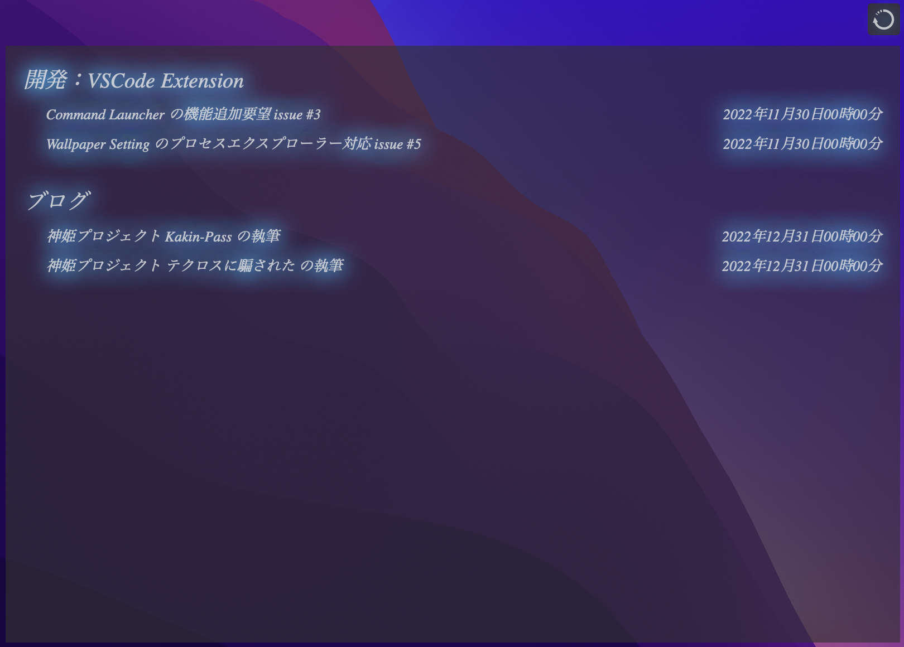

# remember-the-milk.widget
This is a Übersicht widget that displays your tasks. It allows you to display the task of [remember the milk](https://www.rememberthemilk.com/) on your desktop.

## Prerequisites
 - [Übersicht](http://tracesof.net/uebersicht/)
 - [remember the milk account](https://www.rememberthemilk.com/)
 - [remember the milk API Key](https://www.rememberthemilk.com/services/api/)

## Getting Started
### 1. Open Widgets folder
 > Select open `Open Widgets folder` from the Übersicht menu in the top menu bar.

### 2. Move the widget to Übersicht widget folder
 > Drag and drop to set in the Übersicht widget folder.

### 3. Setup

 > Follow the on-screen instructions to grant access to your account.

### 4. Configure widget possition
 > Adjust widget possition as needed.

## Revocation of Access Permission

If you want to revoke access to this widget, please go to `remember the milk` -> `Account` -> `Apps` to do so.

## Third Party Libraries
This widget incorporates and uses the following libraries.

 - [crypto-browserify](https://github.com/crypto-browserify/crypto-browserify)
 - [stream-browserify](https://github.com/browserify/stream-browserify)
 - [buffer](https://github.com/feross/buffer)
